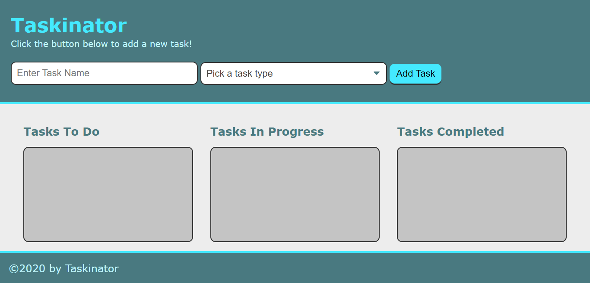

# Luiz Guilherme Padredi

# Taskinator :pencil:

## :label: Description
This program was designed to help a person to keep track of their tasks.

## :scroll: Instructions
Enter the name of a task and its type, then click the button to add task. 
Once a task is added, its name can be edited, the task's status can be changed, and the task can be deleted.

## 	:hash: Coding Languages Used
:heavy_check_mark: HTML 
:heavy_check_mark: CSS 
:heavy_check_mark: JavaScript  
jQuery and Bootstrap were not used.

## :desktop_computer: Website
Link to Website: https://padredilg.github.io/taskinator/
  
Screenshot from Website:

## :clap: Credits

:hammer_and_wrench: Created by Luiz Guilherme Padredi